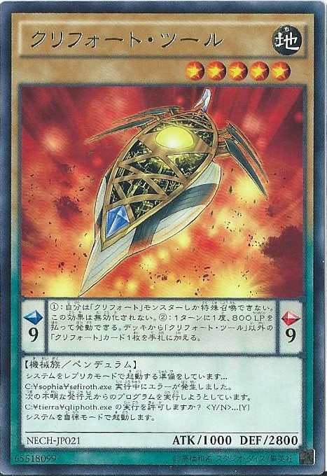
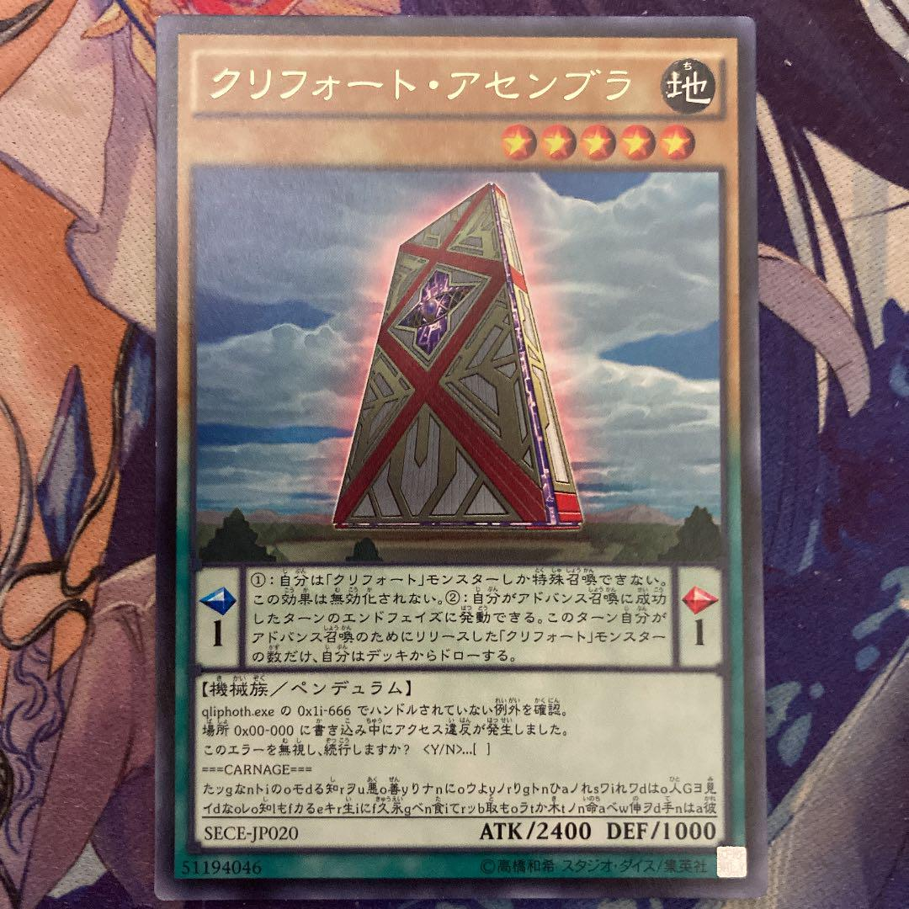

#はじめに
　みなさん遊戯王はご存じですか？実は遊戯王カードでは通常モンスターは効果の欄にフレーバーテキストが書かれています。そのフレーバーテキストの中でプログラミングを意識して作られたようなテーマがあるのは知っていますか？
　そうですご存知【クリフォート】ですよね。【クリフォート】でフレーバーテキストがみられるのはクリフォート・ツールとクリフォート・アセンブラの二枚となっています。ペンデュラムカードになじみがない方にはなんだこれと思う人もいるかもしれませんね笑
#テキストを見る

クリフォート・ツール【モンスター情報】
システムをレプリカモードで起動する準備をしています...
C:¥sophia¥sefiroth.exe 実行中にエラーが発生しました。
次の不明な発行元からのプログラムを実行しようとしています。
C:¥tierra¥qliphoth.exe の実行を許可しますか？ ...[Y]
システムを自律モードで起動します。

クリフォート・アセンブラ【モンスター情報】
qliphoth.exe の 0x1i-666 でハンドルされていない例外を確認。
場所 0x00-000 に書き込み中にアクセス違反が発生しました。
このエラーを無視し、続行しますか？ 〈Y/N〉...[ ]
===CARNAGE===
たッgなnトiのoモdる知rヲu悪o善yりナnにoウよyノrりgトnひaノれsワiれワdはo人Gヨ見
イdなoレo知lもfカるeキr生iにf久永gベn食iてrッb取もoラtか木tノn命aベw伸ヲd手nはa彼

#解説
　クリフォートの語源は「クリフォト(Qliphoth)」＋「フォート（砦）」の合成語であると考えられています。
「クリフォト」とは、ユダヤの神秘主義カバラにおける悪の勢力もしくは不均衡な諸力を表す概念であり、セフィロトの裏の存在とも言われており、一説によればクリフォトは邪悪なものではなく、通常のリアリティの裏に隠された虚のリアリティの世界であるともされ、表裏一体の関係であると考えられています。
　またクリフォートには「機殻」という漢字表記もあてられますが、「クリフォト」という言葉自体がヘブライ語で「皮」「殻」を意味する「クリファ(Qlipha)」の複数形である事に由来するのだと考えられますね。

　ツールのテキストではパスが「C:」で始まっており、区切り記号にバックスラッシュではなく円記号が使われている所を見ると、このコンソールは日本語版のWindowsかMS-DOS互換環境で動いているのだろうか？と予想されます。
　また「sophia」フォルダ、明示の無い「次の不明な発行元」を始めとして、「Y」を選択した（この時点では『自律モード』でない）操作者の存在を匂わせるなど、内容には多くの謎の存在が示されていて、「レプリカモード」が「sophia」内部を参照しているのに対し、起動する「自律モード」は「tierra」直下「qliphoth」を要求しているのも作中世界観の【端末世界】何らかの示唆を感じられます。

　アセンブラのテキストでは    前半部分にはメモリアドレスを指していると思われるコード「0x1i-666」および「0x00-000」が見られますが、「0x」で始まるアドレスは16進記数法（０～９およびＡ～Ｆで数を表す方法）で記されるので、「i」が出現することは通常考えられないですよね。ここでクリフォートがクリフォトをモチーフにしているであろうことを考えると、これは虚数単位を表しているのだろうと読めますね。
　また「666」は新約聖書においてサタンにつながると言われる「獣の数字」であり、転じて悪魔、「ヨハネの黙示録」においては人間を指す数字とされています。
　これらを総合すると、「0x1i」は第一クリファであるバチカルを、「0x1i-666」はバチカルに割り当てられた悪魔であるサタンを指していると考えられます。
　メモリアドレスの下１桁が「６」になるのは８ビットOSか16ビットOSであるため、「qliphoth.exe」の動作環境はそのいずれかであると推測されます。
　また「0x00-000」のように仮想アドレスが全て０で示されるメモリ（０番地）は、殆どのOSではアクセス不能な領域としてマッピングされており、プログラミング言語では無効なポインタとしてこのアドレスを示すことが多いので、このフレイバー・テキストのように０番地の書き込み・読み込みを行おうとして発生するエラーの原因は大抵プログラムそのものの欠陥なのですが、「qliphoth.exe」はバグを抱えたアプリケーションなのでしょうか？
#おわり
　このようにクリフォートの基軸カード二枚から遊戯王で見るプログラミングについて解説してみました。ちなみに【クリフォート】の海外版のテーマ名は【Qli】なんです。なんだかエッチな響きですよね♡♡♡
　