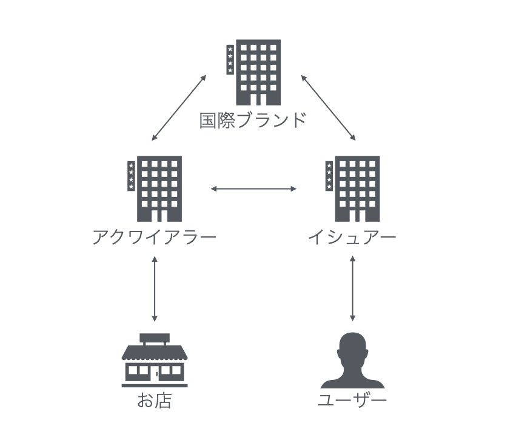

# クレジットカードと表現に対する要請について
クレジットカード関連で昨今世間を賑わせているあのニュースをご存知だろうか。
そう、2024年3月末頃大きな話題となったDLsiteの成人向けコンテンツの表現の置き換えおよびVisa/MasterCard/American Expressの取引停止である。
本内容では、この件について、クレジットカードについての話から今後について考えていく。

## クレジットカードについて
まず、クレジットカードについてざっくりと理解を深めていく。

### クレジットカードとは？
クレジットカードとはなんだろうか。
デジタル大辞泉から引用[^1]すると
>銀行・商店などと提携したカード会社が会員に発行するカード。現金を支払わずに、カードを提示するだけで買い物などができる。クレカ。

[^1]:https://kotobank.jp/word/%E3%82%AF%E3%83%AC%E3%82%B8%E3%83%83%E3%83%88%E3%82%AB%E3%83%BC%E3%83%89-57522#E3.83.87.E3.82.B8.E3.82.BF.E3.83.AB.E5.A4.A7.E8.BE.9E.E6.B3.89

とのことで、簡単に言うと、現金の持ち合わせがなくても後払いで買い物ができるカードのことである。
特に、インターネットでは現金での取引が難しいこともあり、クレジットカードでの決済が多数を占めている。

実際の仕組みも単純化すれば難しいものではない。
利用者とカード加盟店となるお店との間にクレジットカード会社が挟まり、手数料を取ってお金周りのやり取りをするかたちである。

ただし、詳しく説明するともう少し複雑になる。
挟まっているクレジットカード会社には、国際ブランド、イシュアー、アクワイアラーの3社が存在している。

まず、イシュアーが一番わかりやすい。
クレジットカード発行会社のことである。
こちらは利用者と契約を行い、カードを発行する役割がある。

続いて、アクワイアラー。
加盟店管理会社のことである。
言ってしまえば、お店側の契約を行っている。

そして、国際ブランド。
こちらは、その名の通り、決済システムが世界中で提供できるモデルを提供している。

国際ブランドが各イシュアーやアクワイアラーと契約し、決済ネットワークを構築していることになる。
VISAやMasterCardの名前が書いてあればそのカードが使えるようになるのも、それら国際ブランドと契約しているアクワイアラーがお店と契約することで使えるようになっているわけである。

また、一般的な会社では決済代行会社を利用し、複数のアクワイアラーと直接契約することなく各国際ブランドが利用できるようになっている。

### 初期のクレジットカード
クレジットカードの始まりは詳しいところを見た方が良い。
検索でトップに上がっていた三井住友カードのwebページ[^2]を参考にしよう。
[^2]:https://www.smbc-card.com/nyukai/magazine/knowledge/card-history.jsp

フィクションとしてはアメリカの小説家エドワード・ベラミーの『顧みれば』というSF小説では出ていたが、実際に利用され起源として挙がっているのは19世紀末に使用された「フランク」というものらしい。
これは、電報を打った料金をひと月分まとめて支払うというように発行した会社に支払う料金を後払いできるようにしたもの。
今のクレジットカードとは少し違うが、似たようなかたちとなっている。

### 現在のクレジットカード
初期のカードがだんだん発展していき、1990年から始まったICチップ搭載クレジットカードの発行などで暗証番号のみの入力だけで済むなど支払いが楽になった。
その中で、ネットでの決済が増えたことにより、偽の入力サイトに入れさせるフィッシング詐欺や、規則的であるカード番号を利用しての番号生成や、ダークウェブなどで売買されているカード番号を利用した総当たり的なクレジットマスターでの不正利用が大きな問題となっている。
それらへの対策として、決済時にパスワード入力やOTPによる番号入力を行わせる3Dセキュアといった、セキュリティ面の強化を目的とした様々な機能が追加されている。

## クレジットカードによる表現に対する要請
さっくりとクレジットカードについて理解したところで、本題である表現に対する要請について触れていく。
### 表現への要請が進んだ理由
元来よりもちろん推奨とはなっていなかったが、2018年の夏頃より決済を断られる事例が発生していた[^3]。
[^3]:https://bunshun.jp/articles/-/58846

また、アダルトを積極的に排除し始めたのは2020年12月のニューヨーク・タイムズによる記事および、2022年8月のPornhubを訴える裁判でVisaも責任を問われることになった件[^4]が影響していると考えられている。
[^4]:https://forbesjapan.com/articles/detail/49316

こういった事態が明らかとなり、また訴えが発生しカードブランドとしても責任が問われるようになったことで、リスクを最小化するため加盟店に厳しい要請を行うようになったと考えられる。

### 日本で話題となった表現に対する要請や取引停止
日本で発生している表現に対する要請や取引停止はニコニコ大百科のまとめ[^5]が詳しい。

[^5]:https://dic.nicovideo.jp/a/%E3%82%AF%E3%83%AC%E3%82%B8%E3%83%83%E3%83%88%E3%82%AB%E3%83%BC%E3%83%89%E5%9B%BD%E9%9A%9B%E3%83%96%E3%83%A9%E3%83%B3%E3%83%89%E3%81%AB%E3%82%88%E3%82%8B%E8%A1%A8%E7%8F%BE%E3%81%AB%E5%AF%BE%E3%81%99%E3%82%8B%E8%A6%81%E8%AB%8B%E3%81%B8%E3%81%AE%E5%AF%BE%E5%BF%9C

その中でも、一般ユーザーにまで大きく話題が広がったのは2022年8月のDMM.comのMasterCard取引停止、2022年11月のpixivの表現修正要求、2023年11月のニコニコのMasterCard/American Expressの取引停止、そして2024年3月のDLSiteの表現の置き換えおよびVisa/MasterCard/American Express取引停止であろう。

それぞれについて詳細は控えるが、いわゆる前項で挙げた時期とも一致している。
これらにおいて挙げられる共通点としては、CtoC(Consumer to Consumer)のビジネスモデルであると思われる。

#### 基準となる規約
表現に対する要請について、興味深いVisaのProgramを見てみよう。
Visa Integrity Risk Program(VIRP)というものがある。
これは2023年5月にもともとあったGlobal Brand Protection Program(GBPP)に代わるものとして制定された[^6]もので、High-Integrity Risk Merchantsを定義し、適切な管理を課すものである。

このVIRPでは、「Child sexual abuse materials」「Incest」「Bestiality」「Rape(or any other non-consensual sexual behavior)」「Non-consensual mutilation of a person or body part」といった項目が名指しで挙げられ、それらの写真、ビデオ、CG、漫画、シミュレーションといったものの販売にはVisaが使えないことが定められている。[^7]

また、これらに違反した場合には上限40万ドルの罰金等様々なペナルティが課されるということになっている。[^8]

[^6]:https://www.austreme.com/en/visa-is-introducing-the-visa-integrity-risk-program-virp-on-1-may-2023/
[^7]:https://usa.visa.com/content/dam/VCOM/download/about-visa/visa-rules-public.pdf
[^8]:https://www.austreme.com/en/visa-integrity-risk-program-virp-pricing-latest-updates-october-2023/

## これから
最後に今後について考えていく。
### この表現に対する要請は広がるか
前章の最後の項目に挙げた通り、VISAは2023年に制定した新しいProgramがある。
これらで更に要請が広がっていくことは疑いの余地はない。
現時点では対象外になっているBtoCのビジネスモデルにも広がっていくと考えられる。

### 代替となる手段
同じクレジットカードでいうと、アジアで初めての国際ブランドとなったJCBが現状の代替手段となりうる。
現在取引停止を宣告された加盟店においても利用できるため、今後はどうなるかはわからないが、代替となりうる。

また、クレジットカード以外でも2016年ごろから中国等で話題になっていたQR決済サービスからの流れを汲み、2018年ごろから日本でもPayPayを筆頭としたQR決済サービスが2024年の今では一定のシェアを確保するなど伸長してきている。

最近は銀行法や金融サービス提供法の改正によりフィンテックと呼ばれる事業領域も活況を迎えている。
後払いサービスや銀行から直接振り込むものなど、代替となる手段は多く生まれている。

### 最後に
要請があるようなジャンルを好んでいなくとも、そのジャンルの扱いをやめたくない加盟店側で取引停止というのは十分に考えられる。
様々な決済手段を用意し備えておくのが、今後の快適な生活を行うために必要であろう。

